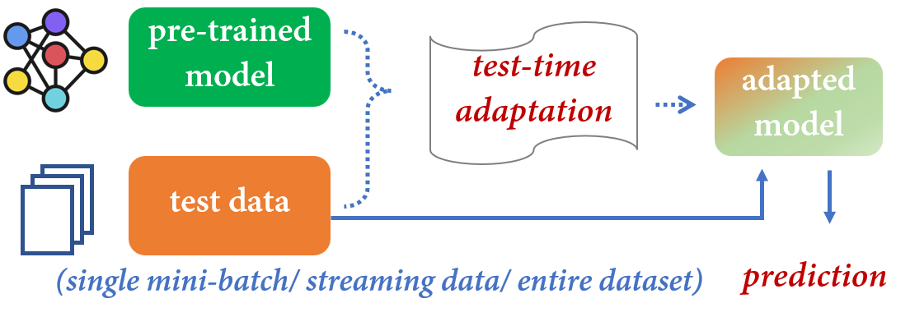

# Awesome Test-Time Adaptation [](https://awesome.re)

A curated list of awesome test-time (**<u>domain/ batch/ instance/ online/ prior</u>**) adaptation resources. Your contributions are always welcome!

## Problem


## Contents
- [Test-Time (Source-Free) Domain Adaptation (SFDA)](./TTA-SFDA.md)

- [Test-Time Batch Adaptation (TTBA)](./TTA-TTBA.md/#Batch-level)

- [Test-Time Instance Adaptation (TTIA)](./TTA-TTBA.md/#Instance-level)

- [Online Test-Time Adaptation (OTTA)](./TTA-OTTA.md)

- [Test-Time Prior Adaptation (TTPA)](./TTA-TTPA.md)

## Datasets
A list of commonly used datasets in TTA is available in [Google Sheets](https://docs.google.com/spreadsheets/d/10tOlFDA5hLSpyv5Wv8zRcXSbUEDLfxP-YhU82AZvYJo/edit?usp=sharing).

## Citation
If you find our survey and repository useful for your research, please consider citing our paper:
```bibtex
@article{liang2023ttasurvey,
  title={A Comprehensive Survey on Test-Time Adaptation under Distribution Shifts},
  author={Liang, Jian and He, Ran and Tan, Tieniu},
  journal={arXiv preprint arXiv:2303.15361},
  year={2023}
}
```